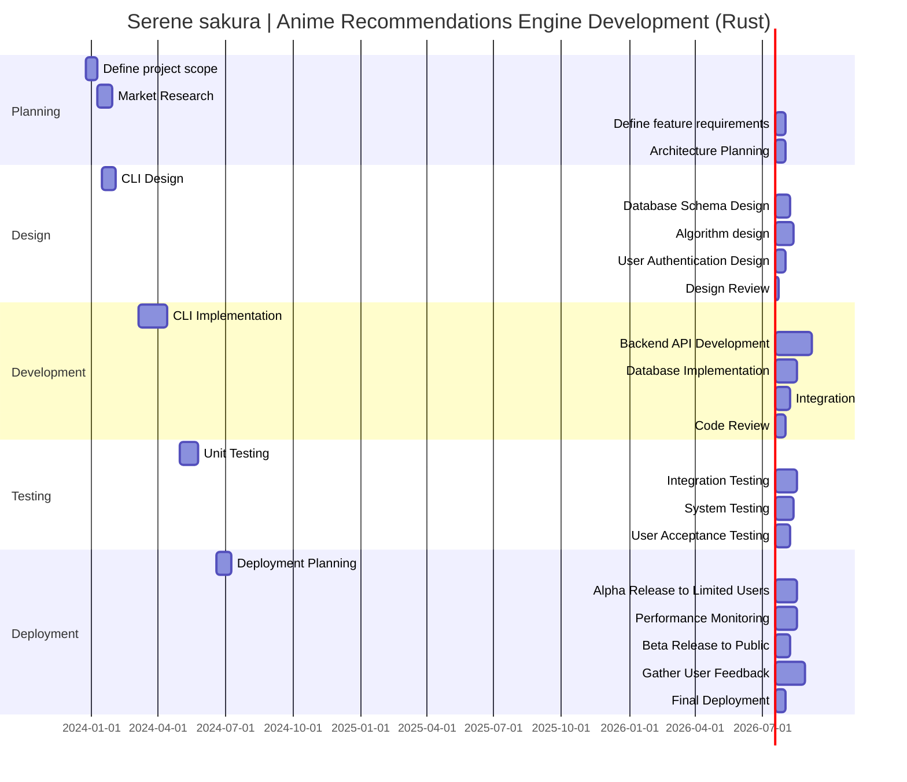

# Serene Sakura Anime Recommendations Engine Development Gantt Chart

> This Gantt chart illustrates the development journey of the "Serene Sakura" anime recommendations engine, implemented in the Rust programming language.

