# The Meme Generator Architectural Kata by kenjitheman, October 29, 2023

<!--toc:start-->
- [The Meme Generator Architectural Kata by kenjitheman, October 29, 2023](#the-meme-generator-architectural-katabrby-kenjitheman-october-29-2023)
  - [Contents](#contents)
  - [Welcome](#welcome)
    - [About the MemeChad](#about-the-memechad)
  - [Business Case](#business-case)
    - [Current Scenario](#current-scenario)
    - [Business Drivers](#business-drivers)
    - [Business Goals](#business-goals)
  - [System Requirements](#system-requirements)
    - [Stakeholders](#stakeholders)
    - [Functional Requirements](#functional-requirements)
    - [Architecture Characteristics Requirements](#architecture-characteristics-requirements)
    - [Constraints](#constraints)
    - [Assumptions](#assumptions)
  - [Baseline Architecture](#baseline-architecture)
    - [System Context](#system-context)
    - [Containers](#containers)
    - [Dynamic View](#dynamic-view)
  - [Target Architecture](#target-architecture)
    - [Use Case](#use-case)
    - [System Context](#system-context)
    - [Containers](#containers)
    - [Process Views](#process-views)
      - [UC-2: Customer Registration](#uc-2-customer-registration)
      - [UC-3: Ticket submission](#uc-3-ticket-submission)
      - [UC-3: Ticket assignment](#uc-3-ticket-assignment)
      - [UC-3: Ticket acceptance](#uc-3-ticket-acceptance)
      - [UC-3: Ticket in-progress](#uc-3-ticket-in-progress)
      - [UC-3: Ticket completion](#uc-3-ticket-completion)
      - [UC-3: Ticket Resolved](#uc-3-ticket-resolved)
      - [UC-4: Survey Submission](#uc-4-survey-submission)
      - [UC-7: Monthly billing](#uc-7-monthly-billing)
    - [Deployment](#deployment)
  - [Transition Architecture](#transition-architecture)
    - [Risk Analysis](#risk-analysis)
      - [Performance](#performance)
      - [Availability](#availability)
      - [Security](#security)
      - [Other](#other)
<!--toc:end-->

## Contents

- [Welcome](#welcome)
    - [About the MemeChad](#about-the-memechad)
- [Business Case](#business-case)
    - [Current Scenario](#current-scenario)
    - [Business Drivers](#business-drivers)
    - [Business Goals](#business-goals)
- [System Requirements](#system-requirements)
    - [Stakeholders](#stakeholders)
    - [Functional Requirements](#functional-requirements)
    - [Architecture Characteristics Requirements](#architecture-characteristics-requirements)
    - [Constraints](#constraints)
    - [Assumptions](#assumptions)
- [Baseline Architecture](#baseline-architecture)
    - [System Context](#system-context)
    - [Containers](#containers)
    - [Dynamic View](#dynamic-view)
- [Target Architecture](#target-architecture)  
    - [Use Case Model](#use-case-model)  
    - [System Context](#system-context)  
    - [Containers](#containers)  
    - [Process Views](#process-views)
        - [Customer Registration](#customer-registration)
        - [Ticket Submission](#ticket-submission)
        - [Ticket Assignment](#ticket-assignment)
        - [Ticket Acceptance](#ticket-acceptance)
        - [Ticket In-progress](#ticket-in-progress)
        - [Ticket Completion](#ticket-completion)
        - [Ticket Resolved](#ticket-resolved)
        - [Survey Submission](#survey-submission)
        - [Monthly Billing](#monthly-billing)
    - [Deployment](#deployment)
- [Transition Architecture](#transition-architecture)
    - [Risk Analysis](#risk-analysis)
        - [Performance](#performance)
        - [Availability](#availability)
        - [Security](#security)
        - [Other](#other)

## Welcome

Welcome to the Meme Generator Architectural Kata by kenjitheman, October 29, 2023

### About the MemeChad

MemeChad stands as a name intertwined with purpose and significance. Within its essence lies a story that unites me.
This name isn't a mere assortment of letters but a representation of the diverse paths that led us together. Each thread in this tapestry symbolizes a unique journey.
In the collective assembly of MemeChad, each member contributes a distinct tale. There are those who found their calling within the world ofmemes, others who are captivated by the artistry of humor, and those who are impassioned by the creative evolution of internet culture.
MemeChad represents the convergence of these individual narratives into a collective identity. It's a testament to the fusion of our diverseexperiences and our shared commitment to crafting and celebrating the language of humor in the digital realm.

## Business Case

In the ever-evolving landscape of digital expression, MemeChad presents a pioneering solution tailored for meme enthusiasts and creators. MemeChad endeavors to revolutionize the art of meme creation by harnessing the power of artificial intelligence (AI) in a seamlessly integrated meme editor, providing an unparalleled user-friendly experience.

### Current Scenario

Existing meme creation platforms offer limited AI integration and lack a cohesive, user-friendly environment for meme enthusiasts to unleashtheir creativity. The absence of intuitive tools coupled with the complexity of meme creation processes hinders the full potential of digital humor expression. Users often encounter steep learning curves, reducing accessibility and inhibiting their creative freedom.

### Business Drivers

- **Inadequate AI Integration:** Current platforms lack sophisticated AI capabilities, limiting the ease and creativity of meme generation.
- **Growing User Base:** A burgeoning community of meme creators seeks an intuitive, AI-powered solution that simplifies the meme creation process.
- **Market Demand for Enhanced User Experience:** Users desire a user-friendly interface coupled with advanced AI features for streamlined meme creation and editing.

### Business Goals

MemeChad is dedicated to addressing the deficiencies prevalent in existing platforms and aspires to accomplish the following:

- **AI-Integrated Meme Creation:** Robust platform with cutting-edge AI capabilities that simplify meme creation for users at all skill levels.
- **User-Friendly Meme Editor:** Curate an intuitive, built-in meme editor that empowers users with easy-to-use tools for crafting and customizing memes effortlessly.
- **Enhanced User Experience:** Prioritize user satisfaction by offering a seamless, engaging, and user-friendly environment for meme creation and sharing.

MemeChad's vision is to set the benchmark in the meme creation landscape by providing an innovative AI-powered platform that not only simplifies the creation process but also fosters a vibrant, collaborative community.

The proposed solution aims to merge advanced AI technology with an intuitive, built-in meme editor, offering users an unmatched, user-friendly experience. MemeChad's mission is to empower users, democratize meme creation, and lead the charge in reshaping the digital humor space.

## System Requirements

### Stakeholders

This section outlines key stakeholders involved in the system and their primary architectural concerns.

* **SH-1**: **Administrator** (security)
    - Administrators oversee user accounts and billing system security.

* **SH-2**: **User** (availability, performance, scalability, robustness)
    - Users demand an always available, responsive system that efficiently processes their meme creations and ensures no loss of content.

* **SH-3**: **Meme Creator** (availability, performance)
    - Timely access to the meme editor and AI tools is crucial for efficient meme creation. Poor performance affects productivity and user satisfaction.

* **SH-4**: **Manager** (reportability)
    - Managers require comprehensive reporting features to analyze user engagement, popular memes, and system usage.

* **SH-5**: **Support Team** (availability, performance)
    - Immediate access to meme creation tools and user-generated content is crucial as they offer direct user support and assistance.

* **SH-6**: **Development Team** (extensibility)
    - The development team emphasizes modular and extensible architecture to facilitate system changes without disrupting core functionalities.

### Functional Requirements

* **UC-1**: **User Management**:
    - Administrators manage user accounts and permissions.

* **UC-2**: **Meme Creator Registration**:
    - Meme creators register their profiles and preferences.

* **UC-3**: **Meme Creation Workflow**:
    - Users create and edit memes using the integrated AI-powered meme editor.

* **UC-4**: **Sharing and Feedback**:
    - Users share memes and provide feedback on meme quality and usability.

* **UC-5**: **Content Moderation**:
    - Moderators curate and moderate user-generated content for quality and appropriateness.

* **UC-6**: **Reporting and Analytics**:
    - Managers generate reports on user engagement, popular memes, and system performance.

* **UC-7**: **Billing and Subscription**:
    - Automated billing for premium features and subscription management for users.

* **UC-8**: **Notification System**:
    - Users receive notifications on meme creation, feedback, and system updates.

* **UC-9**: **Content Search and Discovery**:
    - Users access a comprehensive search function for discovering and exploring memes.

### Architecture Characteristics Requirements

* **QA-1**: **Scalability** (UC-3)
    - Should accommodate a growing user base with a seamless meme creation experience for millions of users.

* **QA-2**: **Availability** (UC-3, UC-4)
    - High availability to ensure uninterrupted meme creation, sharing, and moderation processes.

* **QA-3**: **Performance** (UC-3, UC-6)
    - Response time for meme creation and editing should be fast and efficient for an optimal user experience.

* **QA-4**: **Robustness** (UC-3)
    - Loss of user-generated content or performance issues may negatively impact user satisfaction.

* **QA-5**: **Security** (UC-2, UC-7)
    - Secure storage and handling of user data, ensuring compliance with industry standards for data protection.

* **QA-6**: **Extensibility** (all use cases, SH-6)
    - The architecture should support easy, efficient upgrades and system modifications without causing system instability.

### Constraints

* **CON-1**: Technology Infrastructure
    - Selection between cloud-based or on-premises infrastructure to host the meme creation platform.
    - Determination of the technology stack for development and AI integration.

### Assumptions

* **ASM-1**: Mobile Application Integration
    - The mobile app is an integral part of the system and remains flexible for enhancements and upgrades.
* **ASM-2**: Helpdesk Access
    - Helpdesk assistants require access to the meme creation and ticketing system, including customer information for seamless support operations.
* **ASM-3**: Call Tracking System Exclusion
    - The call tracking system remains outside the scope of the MemeChad system and its functionalities.
* **ASM-4**: Local Storage of Customer Data
    - The company securely stores customer credit card information internally and does not interface with external third-party payment processors for sensitive customer data handling.

## Baseline Architecture

This section describes the architecture of the current ticket system

Please note that all views are documented in [C4 model](https://c4model.com) style, although only System Context, Container, and dynamic views are presented. The most diagrams use informal notation style. All diagrams are supplied with a key explaining the meaning of each shape on the diagram

The current ticket system demonstrates very poor characteristics of availability, maintainability, deployability, and performance. Our goal is to design a new system that solves the aforementioned problems

The following diagram depicts the containers diagram of the current ticket system:

### System Context

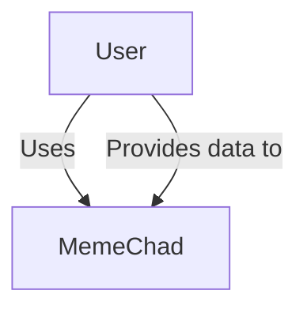

### Containers

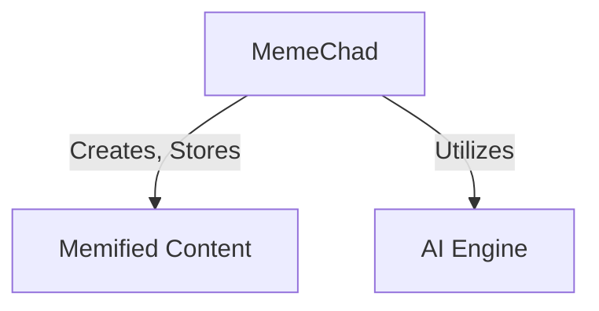

### Dynamic View

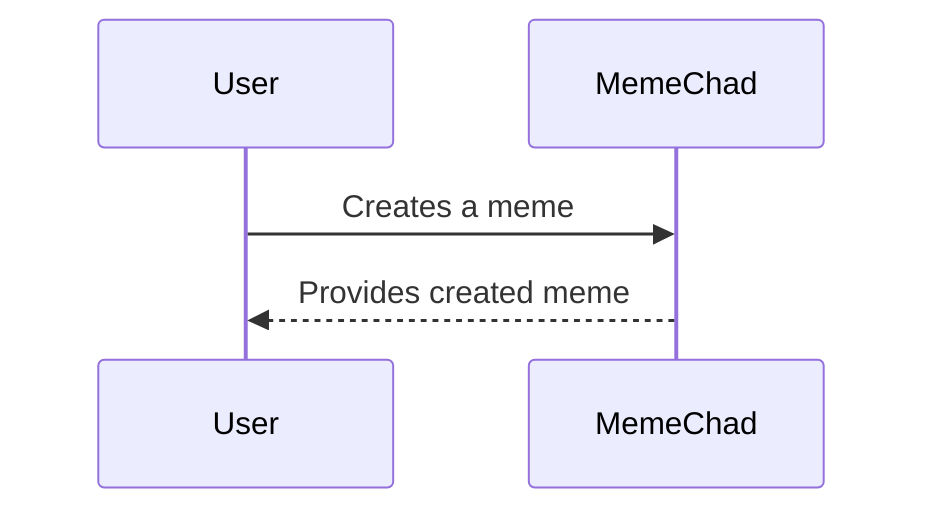

## Target Architecture

This section describes the target software architecture

Please note that all views are documented in [C4 model](https://c4model.com) style, although only System Context, Container, and dynamic views are presented. The most diagrams use informal notation style. All diagrams are supplied with a key explaining the meaning of each shape on the diagram

### Use Case

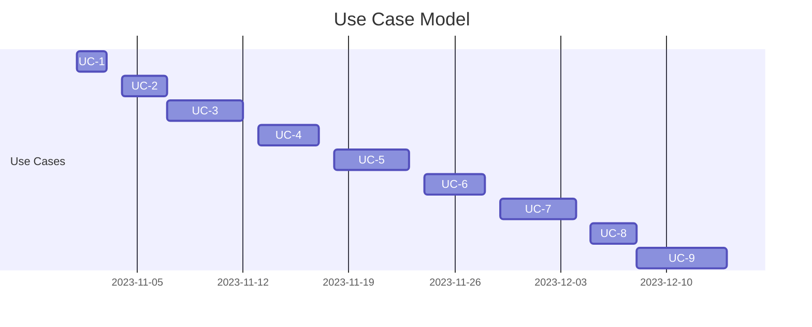

### System Context

The system context diagram below depicted key users of the system and its external dependencies:

### Containers

The containers diagram below offers an in-depth insight into the high-level structure of the software architecture and the distribution of responsibilities across containers. It also illuminates the major technology choices and the inter-container communication

The architecture is centered around four key domains derived from the problem analysis:

- **Customer-facing Services**: This container manages ticket submissions, customer profiles, survey submissions, and other user-related services
- **Expert Services**: Responsible for ticket acceptance and knowledge base search functionalities, supporting the expert users in problem resolution
- **Administration Services**: This container handles reporting, survey analysis, ticket tracking, and other administrative functions
- **Billing Service**: Focused on billing-related operations, it demands heightened attention to security for handling financial data

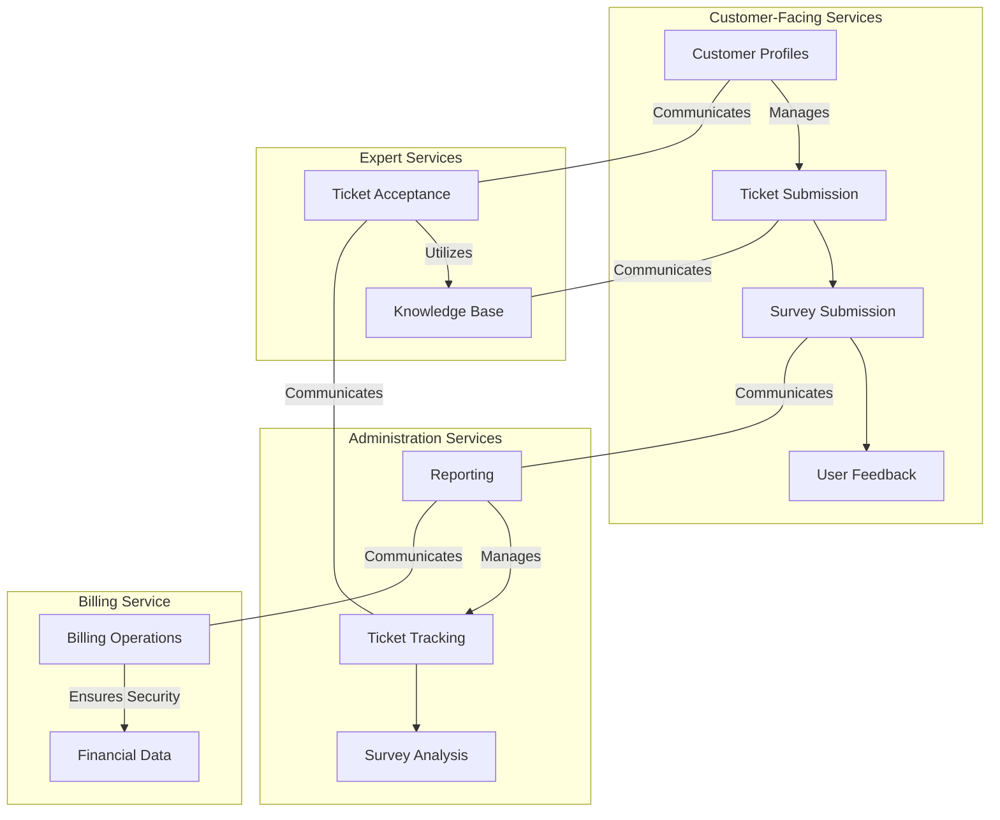

### Process Views

This section explains some key use cases to demonstrate how corresponding workflows pass through containers

#### UC-2: Customer Registration

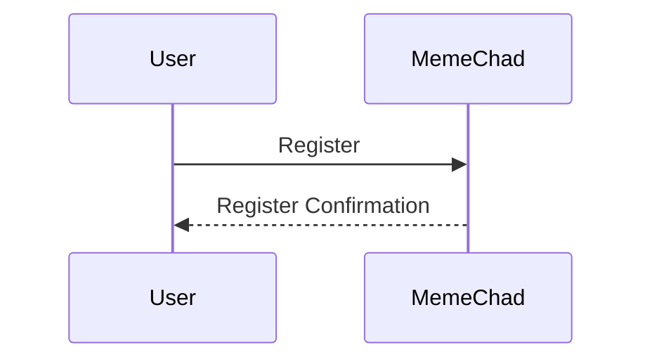

#### UC-3: Ticket submission

The following diagram illustrates the process of a ticket registration by the customer

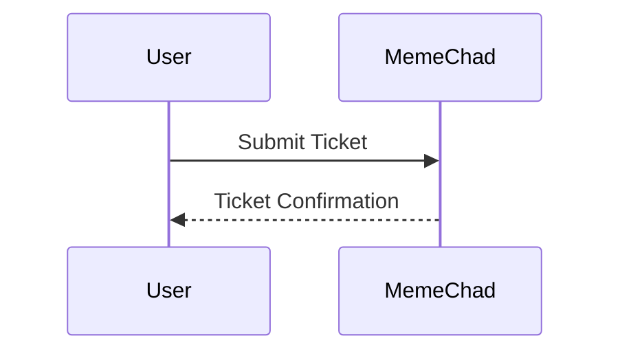

#### UC-3: Ticket assignment

The diagram below explains how the system processes a new ticket and assigns it an expert

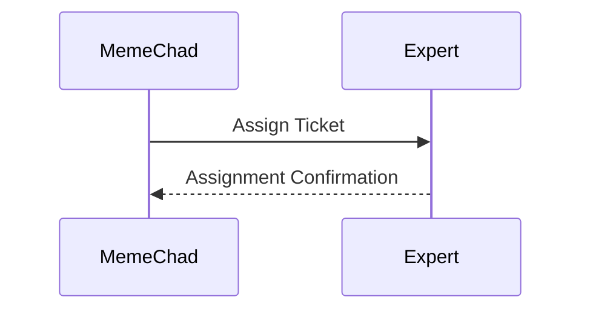

#### UC-3: Ticket acceptance

This diagram continues the ticket workflow and shows how the Ticket Assigned event is processed by the Sysops Expert user

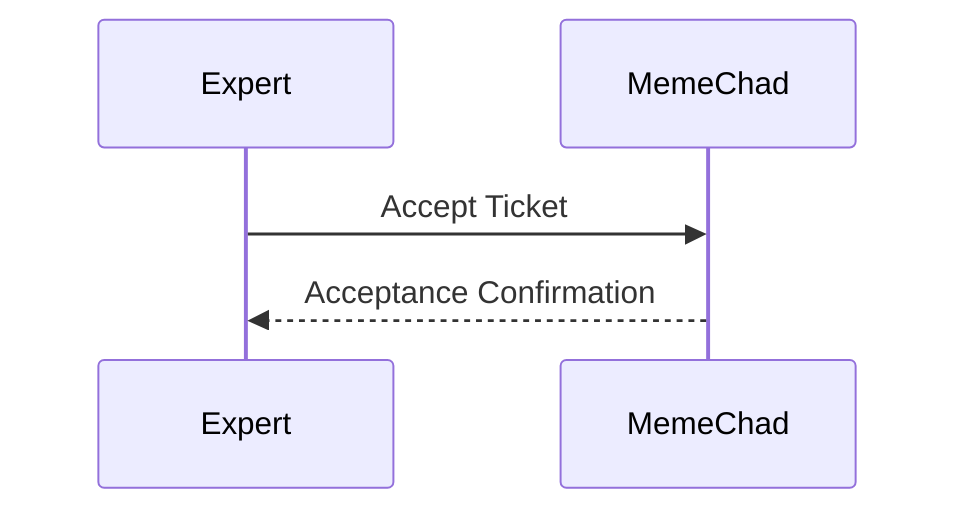

#### UC-3: Ticket in-progress

This diagram demonstrates how the customer is notified when the Sysops Expert accepted the ticket

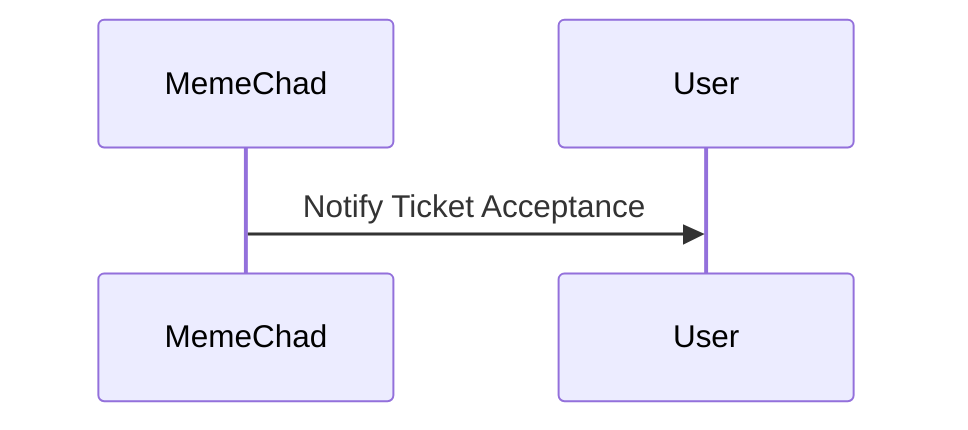

#### UC-3: Ticket completion

This diagram explains the process when the Sysops Expert solved the problem and marks the ticket as completed

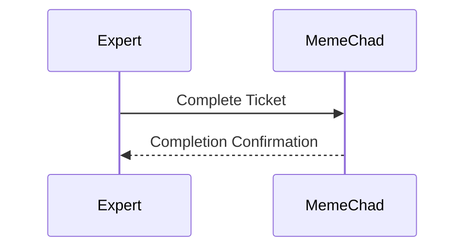

#### UC-3: Ticket Resolved

This diagram illustrates how the customer receives a notification about the ticket resolution and link to the survey form

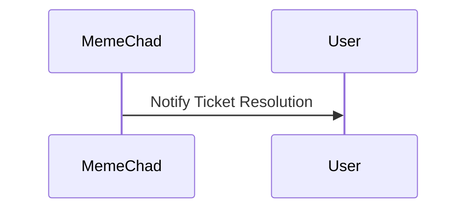

#### UC-4: Survey Submission

And finally the last step in the ticket resolution flow is survey submission by the customer

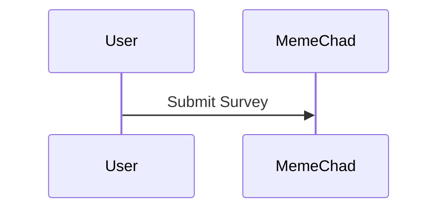

#### UC-7: Monthly billing

The diagram illustrates the monthly billing workflow.

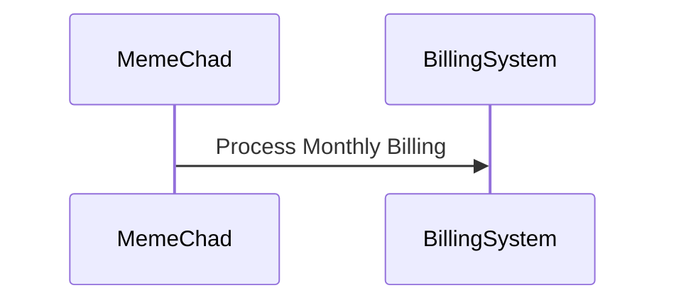

### Deployment

The deployment diagram illustrates how the system containers are mapped to the infrastructure:

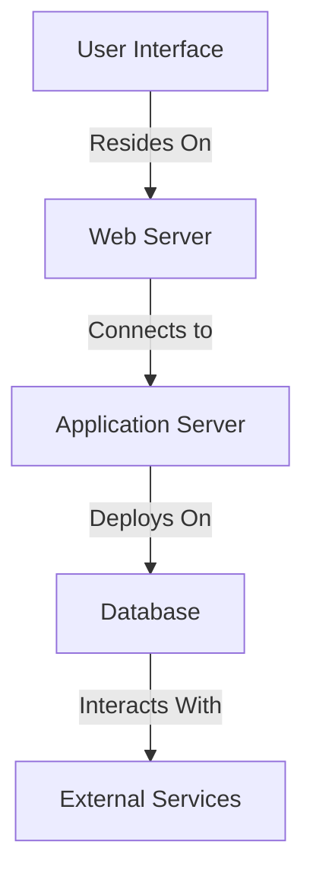

The deployment strategy here is cloud-agnostic, assuming you can use any cloud provider of your choice or stay totally on-prem. An exceptionis the billing stuff, which is recommended to remain on-prem anyway for security considerations.

## Transition Architecture

The proposed solution in the Target Architecture serves as the ultimate solution to address most problems and risks. However, it may requiresubstantial development efforts due to the necessary database split. Therefore, the approach is divided into two phases:

- Address critical issues and continue with a monolithic database until it creates a bottleneck.
- Transition further towards the target architecture to resolve remaining risks.

The transitional architecture resolves critical issues but retains some risks. Notably, it utilizes asynchronous messaging for ticket processing, ensuring independent scalability and availability for different parts of the system. In this context, messages can contain minimal information as the receiver can retrieve details from the database.

Since we have a single monolithic database we can save some efforts on additional messaging and replication.

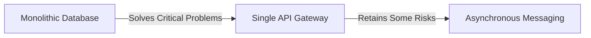

Given the single monolithic database, reduced efforts are required for additional messaging and replication.

### Risk Analysis

The transitional architecture presents several potential high risks.

#### Performance

The monolithic database may pose a performance bottleneck, similar to the concern around the single API Gateway, potentially becoming a bottleneck if not scaled appropriately.

#### Availability

A single API Gateway might introduce a single point of failure for the entire system.

#### Security

There is a risk of admin staff accessing customer credit card data. To mitigate this, it's essential to extract billing into a separate architectural quantum and isolate it within a distinct network zone with strict access permissions.

#### Other

Additional concerns regarding the API Gateway:

- Adds coupling between the gateway and the internal service.
- If developed by a single development team, may become a development bottleneck.
