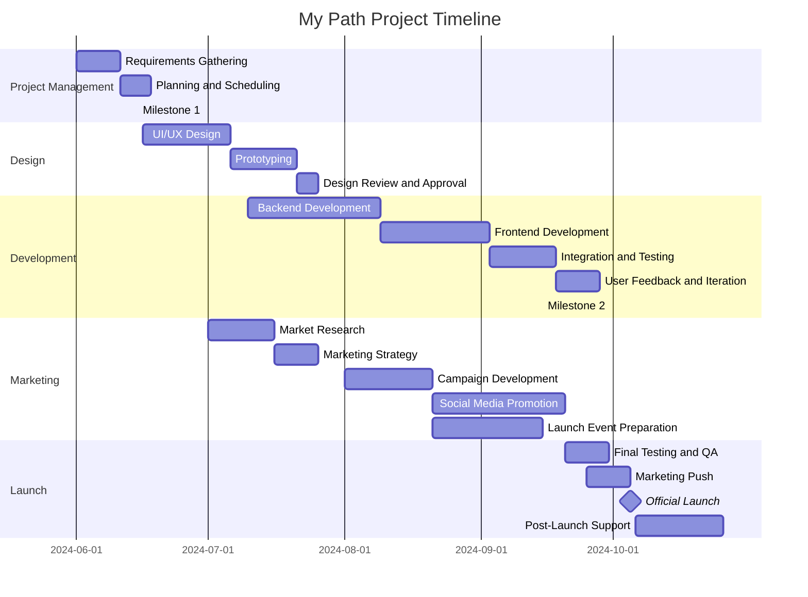

```mermaid
gantt
    title My Path Project Timeline
    dateFormat  YYYY-MM-DD
    section Project Management
    Requirements Gathering    :a1, 2024-06-01, 10d
    Planning and Scheduling   :a2, after a1, 7d
    Milestone 1: Project Kickoff    :milestone, 2024-06-15, 0d
    section Design
    UI/UX Design              :b1, 2024-06-16, 20d
    Prototyping               :b2, after b1, 15d
    Design Review and Approval:b3, after b2, 5d
    section Development
    Backend Development       :c1, 2024-07-10, 30d
    Frontend Development      :c2, after c1, 25d
    Integration and Testing   :c3, after c2, 15d
    User Feedback and Iteration: c4, after c3, 10d
    Milestone 2: Beta Release      :milestone, 2024-09-15, 0d
    section Marketing
    Market Research           :d1, 2024-07-01, 15d
    Marketing Strategy        :d2, after d1, 10d
    Campaign Development      :d3, 2024-08-01, 20d
    Social Media Promotion    :d4, after d3, 30d
    Launch Event Preparation  :d5, after d3, 25d
    section Launch
    Final Testing and QA      :e1, 2024-09-20, 10d
    Marketing Push            :e2, 2024-09-25, 10d
    Official Launch           :milestone, 2024-10-05, 0d
    Post-Launch Support       :e3, 2024-10-06, 20d
```
