# The Meme Generator Architectural Kata by kenjitheman, October 29, 2023

## Contents

- [Welcome](#welcome)
    - [About the MemeChad](#about-the-memechad)
- [Business Case](#business-case)
    - [Current Scenario](#current-scenario)
    - [Business Drivers](#business-drivers)
    - [Business Goals](#business-goals)
- [System Requirements](#system-requirements)
    - [Stakeholders](#stakeholders)
    - [Functional Requirements](#functional-requirements)
    - [Architecture Characteristics Requirements](#architecture-characteristics-requirements)
    - [Constraints](#constraints)
    - [Assumptions](#assumptions)
- [Baseline Architecture](#baseline-architecture)
    - [System Context](#system-context)
    - [Containers](#containers)
    - [Dynamic View](#dynamic-view)
- [Target Architecture](#target-architecture)  
    - [Use Case Model](#use-case-model)  
    - [System Context](#system-context)  
    - [Containers](#containers)  
    - [Process Views](#process-views)
        - [Customer Registration](#customer-registration)
        - [Ticket Submission](#ticket-submission)
        - [Ticket Assignment](#ticket-assignment)
        - [Ticket Acceptance](#ticket-acceptance)
        - [Ticket In-progress](#ticket-in-progress)
        - [Ticket Completion](#ticket-completion)
        - [Ticket Resolved](#ticket-resolved)
        - [Survey Submission](#survey-submission)
        - [Monthly Billing](#monthly-billing)
    - [Deployment](#deployment)
- [Transition Architecture](#transition-architecture)
    - [Risk Analysis](#risk-analysis)
        - [Performance](#performance)
        - [Availability](#availability)
        - [Security](#security)
        - [Other](#other)

## Welcome

Welcome to the Meme Generator Architectural Kata by kenjitheman, October 29, 2023

### About the MemeChad

MemeChad виступає як ім’я, яке переплітається з метою та значенням. У його суті лежить історія, яка мене об’єднує.
Це ім’я — не просто набір літер, а вказує на різноманітні шляхи, які привели нас разом. Кожна нитка в цьому гобелені символізує унікальну подорож.
У колективній асамблеї MemeChad кожен учасник створює окрему історію. Є ті, хто знайшов своє покликання у світі мемів, інші, кого захоплює майстерність гумору, і ті, хто захоплений творчою еволюцією інтернет-культури.
MemeChad представляє конвергенцію цих індивідуальних наративів у колективну ідентичність. Це свідчення злиття нашого різноманітного досвіду та нашої спільної відданості створенню та прославленню мови гумору в цифровій сфері.

## Business Case

У світі цифрового вираження, що постійно розвивається, MemeChad представляє новаторське рішення, створене для ентузіастів і творців мемів. MemeChad намагається революціонізувати мистецтво створення мемів, використовуючи потужність штучного інтелекту (AI) у повністю інтегрованому редакторі мемів, забезпечуючи неперевершену зручність для користувача.

### Current Scenario

Існуючі платформи для створення мемів пропонують обмежену інтеграцію штучного інтелекту та не мають згуртованого, зручного середовища для ентузіастів мемів, щоб розкрити свій творчий потенціал. Відсутність інтуїтивно зрозумілих інструментів у поєднанні зі складністю процесів створення мемів перешкоджає повному використанню потенціалу цифрового гумору. Користувачі часто стикаються з крутими кривими навчання, що зменшує доступність і перешкоджає їхній творчій свободі.

### Business Drivers

- **Неадекватна інтеграція штучного інтелекту:** поточні платформи не мають складних можливостей штучного інтелекту, що обмежує легкість і креативність створення мемів.
- **Зростаюча база користувачів:** Спільнота творців мемів, що розвивається, шукає інтуїтивно зрозуміле рішення на основі ШІ, яке спрощує процес створення мемів.
- **Ринковий попит на покращену взаємодію з користувачем:** Користувачам потрібен зручний інтерфейс у поєднанні з розширеними функціями ШІ для спрощеного створення та редагування мемів.

### Business Goals

MemeChad спрямований на усунення недоліків, поширених на існуючих платформах, і прагне досягти наступного:

- **Інтегроване штучним інтелектом створення мемів:** надійна платформа з передовими можливостями штучного інтелекту, які спрощують створення мемів для користувачів будь-якого рівня кваліфікації.
- **Зручний редактор мемів:** створіть інтуїтивно зрозумілий вбудований редактор мемів, який надає користувачам прості у використанні інструменти для створення та налаштування мемів без зусиль.
- **Покращена взаємодія з користувачем:** перевагa задоволенню користувачів, пропонуючи безперебійне, привабливе та зручне середовище для створення мемів і обміну ними.

Бачення MemeChad полягає в тому, щоб встановити еталон у сфері створення мемів, забезпечивши інноваційну платформу на основі штучного інтелекту, яка не тільки спрощує процес створення, але й сприяє активній спільноті для співпраці.

Пропоноване рішення має на меті поєднати передову технологію штучного інтелекту з інтуїтивно зрозумілим вбудованим редактором мемів, пропонуючи користувачам неперевершений, зручний досвід. Місія MemeChad полягає в тому, щоб розширити можливості користувачів, демократизувати створення мемів і лідирувати в зміні простору цифрового гумору.

## System Requirements

### Stakeholders

У цьому розділі описані основні зацікавлені сторони, залучені до системи, та їхні основні архітектурні проблеми.

* **SH-1**: **Адміністратор** (безпека)
     - Адміністратори контролюють облікові записи користувачів і безпеку білінгової системи.

* **SH-2**: **Користувач** (доступність, продуктивність, масштабованість, надійність)
     - Користувачам потрібна завжди доступна система, що швидко реагує, яка ефективно обробляє створені ними меми та гарантує відсутність втрати вмісту.

* **SH-3**: **Творець мемів** (доступність, продуктивність)
     - Своєчасний доступ до редактора мемів і інструментів AI має вирішальне значення для ефективного створення мемів. Низька продуктивність впливає на продуктивність і задоволеність користувачів.

* **SH-4**: **Менеджер** (підзвітність)
     - Менеджерам потрібні комплексні функції звітування для аналізу взаємодії користувачів, популярних мемів і використання системи.

* **SH-5**: **Команда підтримки** (доступність, продуктивність)
     - Миттєвий доступ до інструментів створення мемів і контенту, створеного користувачами, має вирішальне значення, оскільки вони пропонують пряму підтримку та допомогу користувачам.

* **SH-6**: **Команда розробників** (розширюваність)
     - Команда розробників наголошує на модульній та розширюваній архітектурі, щоб полегшити системні зміни без порушення основних функцій.

### Functional Requirements

* **UC-1**: **Керування користувачами**:
     - Адміністратори керують обліковими записами користувачів і дозволами.

* **UC-2**: **Реєстрація творця мемів**:
     - Творці мемів реєструють свої профілі та налаштування.

* **UC-3**: **Робочий процес створення мемів**:
     - Користувачі створюють і редагують меми за допомогою інтегрованого редактора мемів на основі AI.

* **UC-4**: **Обмін і відгуки**:
     - Користувачі діляться мемами та залишають відгуки про якість та зручність використання мемів.

* **UC-5**: **Модерація вмісту**:
     - Модератори підбирають і модерують створений користувачами вміст на предмет якості та відповідності.

* **UC-6**: **Звітність і аналітика**:
     - Менеджери створюють звіти про залучення користувачів, популярні меми та продуктивність системи.

* **UC-7**: **Оплата та підписка**:
     - Автоматизоване виставлення рахунків за преміум-функції та керування підписками для користувачів.

* **UC-8**: **Система сповіщень**:
     - Користувачі отримують сповіщення про створення мемів, відгуки та оновлення системи.

* **UC-9**: **Пошук і виявлення вмісту**:
     - Користувачі отримують доступ до комплексної функції пошуку для виявлення та вивчення мемів.

### Architecture Characteristics Requirements

* **QA-1**: **Масштабованість** (UC-3)
     - Має враховувати зростаючу базу користувачів із безперебійним досвідом створення мемів для мільйонів користувачів.

* **QA-2**: **Доступність** (UC-3, UC-4)
     - Висока доступність для забезпечення безперервного створення, обміну та модерації мемів.

* **QA-3**: **Продуктивність** (UC-3, UC-6)
     - Час відповіді на створення та редагування мемів має бути швидким і ефективним для оптимальної взаємодії з користувачем.

* **QA-4**: **Надійність** (UC-3)
     - Втрата вмісту, створеного користувачами, або проблеми з продуктивністю можуть негативно вплинути на задоволеність користувачів.

* **QA-5**: **Безпека** (UC-2, UC-7)
     - Безпечне зберігання та обробка даних користувача, забезпечуючи дотримання галузевих стандартів захисту даних.

* **QA-6**: **Розширюваність** (усі випадки використання, SH-6)
     - Архітектура повинна підтримувати легке й ефективне оновлення та модифікацію системи, не викликаючи нестабільності системи.

### Constraints

* **CON-1**: технологічна інфраструктура
     - Вибір між хмарною або локальною інфраструктурою для розміщення платформи створення мемів.
     - Визначення технологічного стеку для розробки та інтеграції ШІ.

### Assumptions

* **ASM-1**: інтеграція мобільних додатків
     - Мобільний додаток є невід’ємною частиною системи та залишається гнучким для покращень і оновлень.
* **ASM-2**: доступ до служби підтримки
     - Помічникам служби підтримки потрібен доступ до системи створення мемів і продажу квитків, включаючи інформацію про клієнтів для безперебійної роботи підтримки.
* **ASM-3**: виключення системи відстеження викликів
     - Система відстеження дзвінків залишається поза межами системи MemeChad та її функцій.
* **ASM-4**: локальне зберігання даних клієнтів
     - Компанія безпечно зберігає інформацію про кредитні картки клієнта всередині та не взаємодіє із зовнішніми сторонніми платіжними процесорами для обробки конфіденційних даних клієнтів.

## Baseline Architecture

У цьому розділі описано архітектуру поточної системи квитків

Будь ласка, зверніть увагу, що всі подання задокументовано в стилі [модель C4](https://c4model.com), хоча представлено лише системний контекст, контейнер і динамічні подання. Більшість діаграм використовують неформальний стиль нотації. Усі схеми постачаються з ключем, що пояснює значення кожної фігури на схемі

Поточна система тикетів демонструє дуже низькі характеристики доступності, ремонтопридатності, розгортання та продуктивності. Mета — розробити нову систему, яка вирішить вищезазначені проблеми

На наступній діаграмі зображено діаграму контейнерів поточної системи квитків:

### System Context

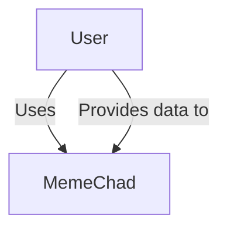

### Containers

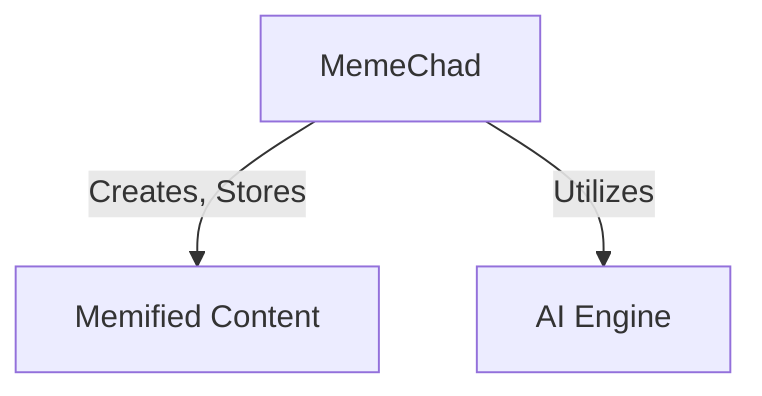

### Dynamic View

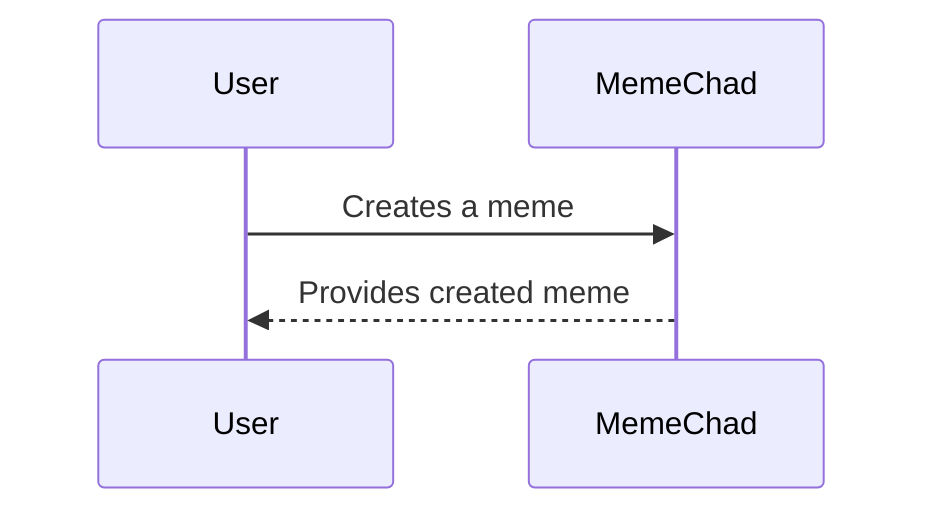

## Target Architecture

У цьому розділі описано цільову архітектуру програмного забезпечення

Будь ласка, зверніть увагу, що всі подання задокументовано в стилі [модель C4](https://c4model.com), хоча представлено лише системний контекст, контейнер і динамічні подання. Більшість діаграм використовують неформальний стиль нотації. Усі схеми постачаються з ключем, що пояснює значення кожної фігури на схемі

### Use Case

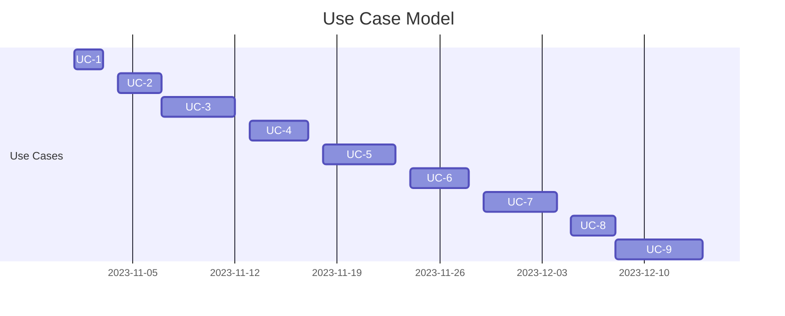

### System Context

Контекстна діаграма системи нижче відображає ключових користувачів системи та її зовнішні залежності:

### Containers

Наведена нижче діаграма контейнерів пропонує поглиблене розуміння високорівневої структури архітектури програмного забезпечення та розподілу обов’язків між контейнерами. Він також висвітлює основні технологічні рішення та взаємодію між контейнерами

Архітектура зосереджена навколо чотирьох ключових областей, отриманих в результаті аналізу проблеми:

- **Сервіси, орієнтовані на клієнтів**: цей контейнер керує заявками, профілями клієнтів, опитуваннями та іншими пов’язаними з користувачами послугами.
- **Експертні служби**: відповідають за прийом квитків і функції пошуку в базі знань, підтримуючи досвідчених користувачів у вирішенні проблем
- **Адміністративні служби**: цей контейнер обробляє звіти, аналіз опитувань, відстеження квитків та інші адміністративні функції
- **Служба виставлення рахунків**: орієнтована на операції, пов’язані з виставленням рахунків, вимагає підвищеної уваги до безпеки обробки фінансових даних.

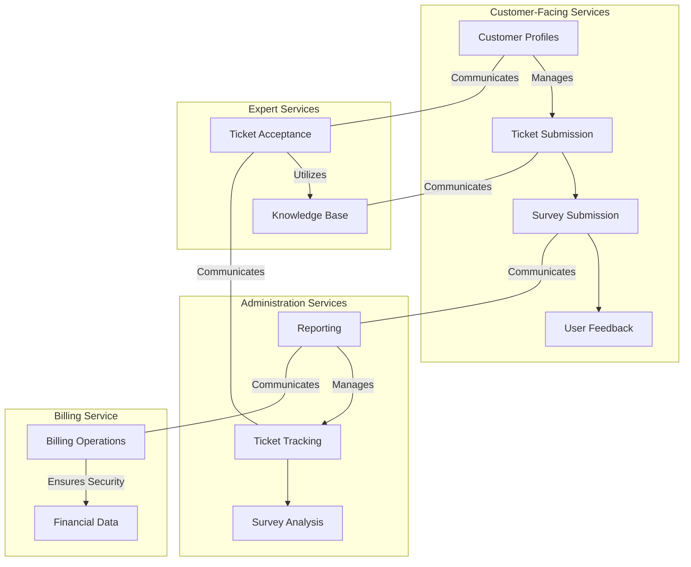

### Process Views

У цьому розділі пояснюється кілька ключових випадків використання, щоб продемонструвати, як відповідні робочі процеси проходять через контейнери

#### UC-2: Customer Registration

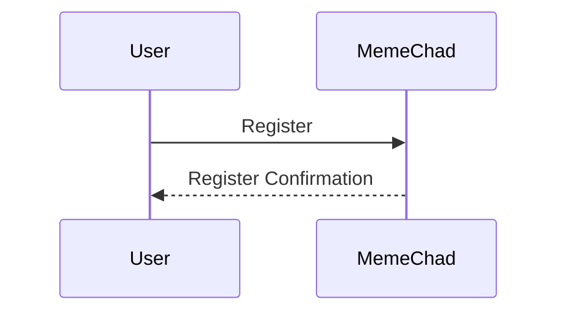

#### UC-3: Ticket submission

Наступна схема ілюструє процес реєстрації квитка замовником

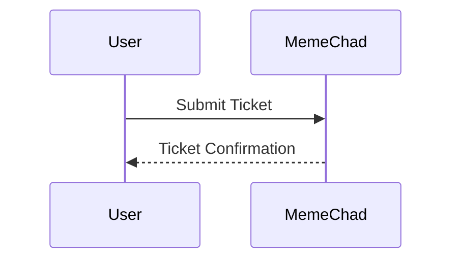

#### UC-3: Ticket assignment

На діаграмі нижче показано, як система обробляє новий квиток і призначає йому експерта

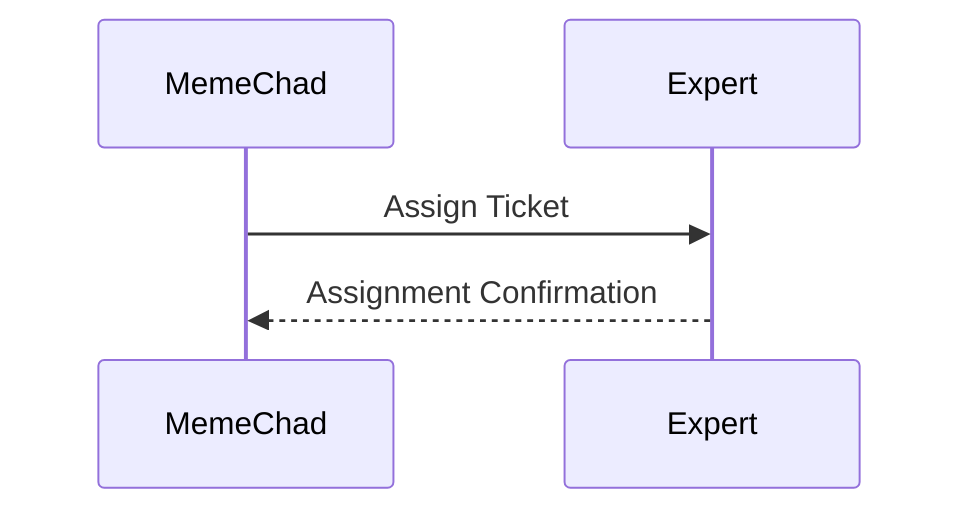

#### UC-3: Ticket acceptance

На цій діаграмі показано, як користувач Sysops Expert обробляє подію Ticket Assigned.

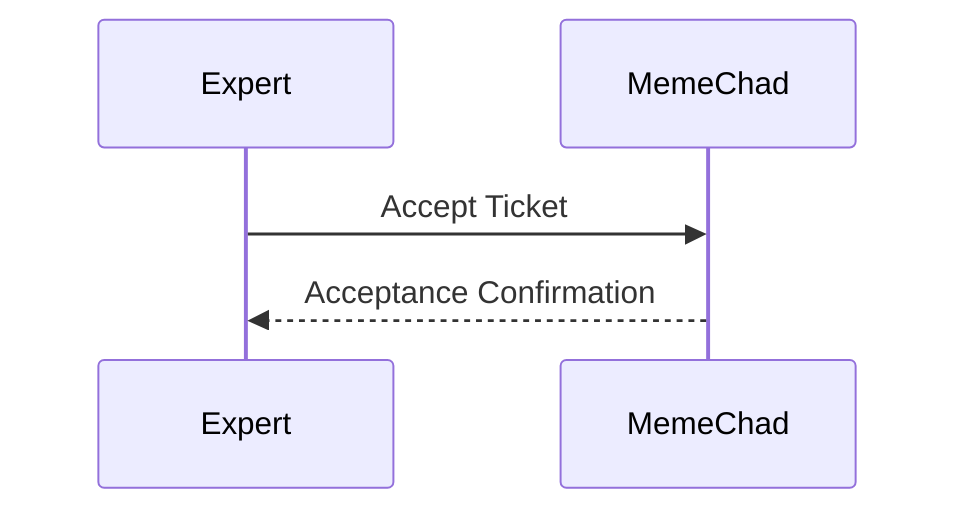

#### UC-3: Ticket in-progress

Ця діаграма демонструє, як клієнт отримує сповіщення, коли експерт Sysops прийняв заявку

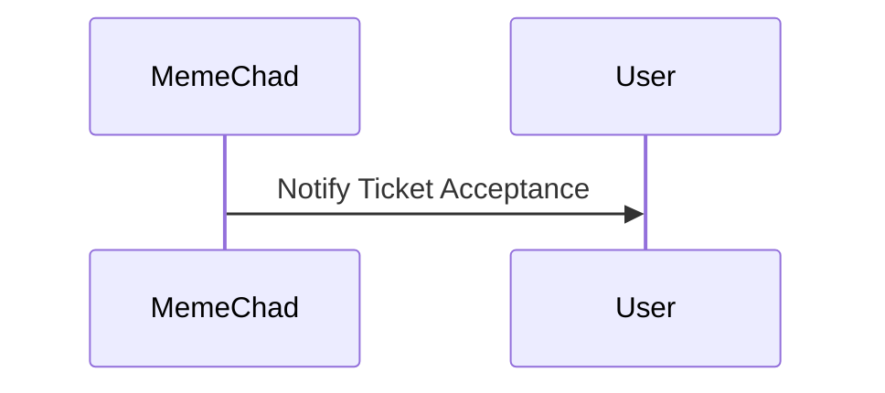

#### UC-3: Ticket completion

На цій діаграмі пояснюється процес, коли експерт Sysops вирішує проблему та позначає заявку як завершену

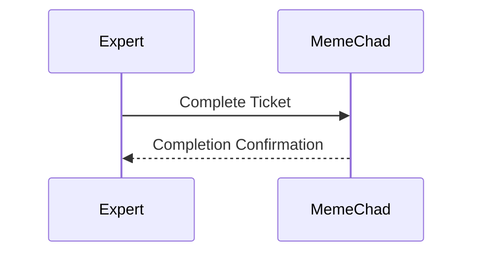

#### UC-3: Ticket Resolved

На цій діаграмі показано, як клієнт отримує сповіщення про вирішення запиту та посилання на форму опитування

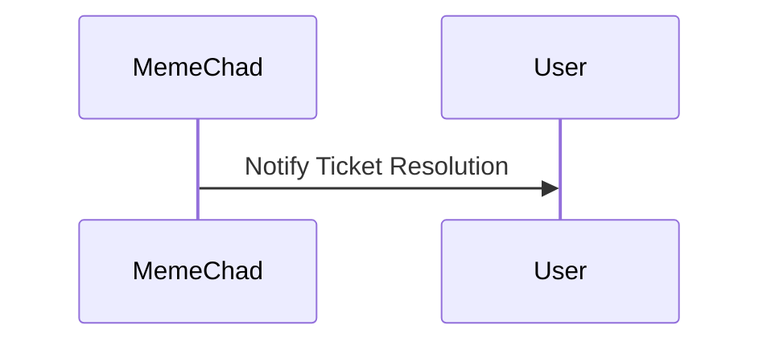

#### UC-4: Survey Submission

And finally the last step in the ticket resolution flow is survey submission by the customer

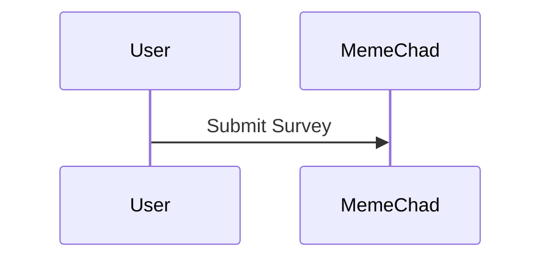

#### UC-7: Monthly billing

Діаграма ілюструє робочий процес щомісячного виставлення рахунків.

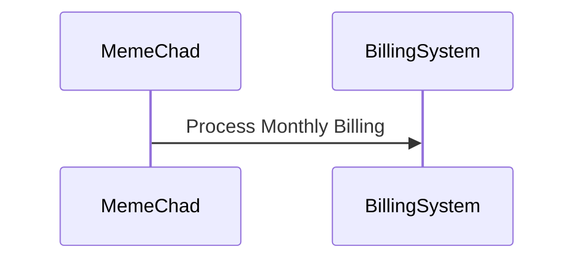

### Deployment

Діаграма розгортання ілюструє, як системні контейнери зіставляються з інфраструктурою:

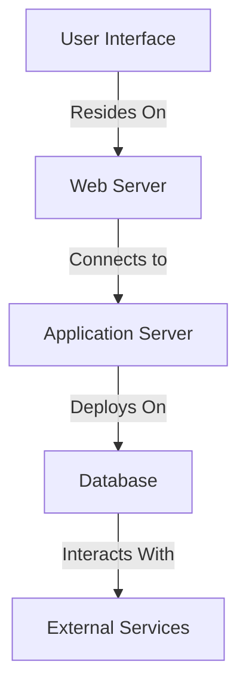

Стратегія розгортання тут не залежить від хмари, припускаючи, що ви можете використовувати будь-якого хмарного постачальника на свій вибір або залишатися повністю локальним. Винятком є питання виставлення рахунків, які з міркувань безпеки все одно рекомендується залишати локальними.

## Transition Architecture

Запропоноване рішення в цільовій архітектурі служить остаточним рішенням для вирішення більшості проблем і ризиків. Однак це може вимагати значних зусиль щодо розробки через необхідне розділення бази даних. Тому підхід розділений на два етапи:

- Вирішуйте критичні проблеми та продовжуйте працювати з монолітною базою даних, поки вона не створить вузьке місце.
- Подальший перехід до цільової архітектури для усунення решти ризиків.

Перехідна архітектура вирішує критичні проблеми, але зберігає деякі ризики. Зокрема, він використовує асинхронний обмін повідомленнями для обробки квитків, забезпечуючи незалежну масштабованість і доступність для різних частин системи. У цьому контексті повідомлення можуть містити мінімальну інформацію, оскільки одержувач може отримати деталі з бази даних.

Оскільки у нас єдина монолітна база даних, ми можемо заощадити деякі зусилля на додатковому обміні повідомленнями та реплікації.

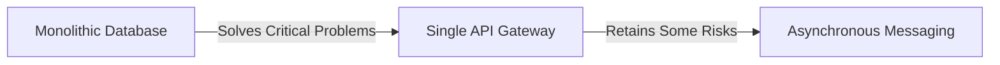

Враховуючи єдину монолітну базу даних, для додаткового обміну повідомленнями та реплікації потрібно менше зусиль.

### Risk Analysis

Перехідна архітектура представляє кілька потенційно високих ризиків.

#### Performance

Монолітна база даних може стати вузьким місцем продуктивності, подібно до занепокоєння щодо єдиного шлюзу API, потенційно стати вузьким місцем, якщо її не масштабувати належним чином.

#### Availability

Один шлюз API може створити єдину точку відмови для всієї системи.

#### Security

Існує ризик отримання персоналом адміністратора доступу до даних кредитної картки клієнта. Щоб пом’якшити це, важливо виділити білінг в окремий архітектурний квант і ізолювати його в окремій зоні мережі зі строгими правами доступу.

#### Other

Додаткові зауваження щодо шлюзу API:

— Додає зв’язок між шлюзом і внутрішньою службою.
- Якщо розроблено однією командою розробників, це може стати вузьким місцем розробки.
