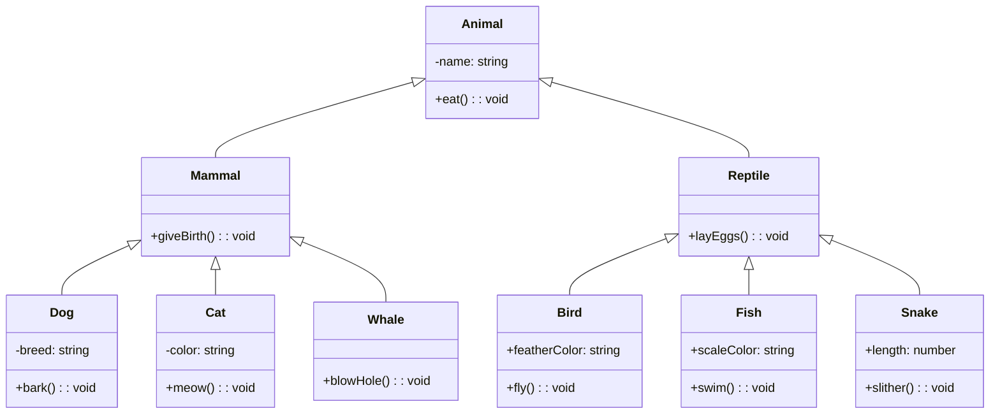

# umlman

```mermaid
classDiagram
  class Animal {
    -name: string
    +eat(): void
  }

  class Mammal {
    +giveBirth(): void
  }

  class Reptile {
    +layEggs(): void
  }

  class Dog {
    -breed: string
    +bark(): void
  }

  class Cat {
    -color: string
    +meow(): void
  }

  class Bird {
    +featherColor: string
    +fly(): void
  }

  class Fish {
    +scaleColor: string
    +swim(): void
  }

  class Whale {
    +blowHole(): void
  }

  class Snake {
    +length: number
    +slither(): void
  }

  Animal <|-- Mammal
  Animal <|-- Reptile
  Mammal <|-- Dog
  Mammal <|-- Cat
  Reptile <|-- Bird
  Reptile <|-- Fish
  Mammal <|-- Whale
  Reptile <|-- Snake
```
