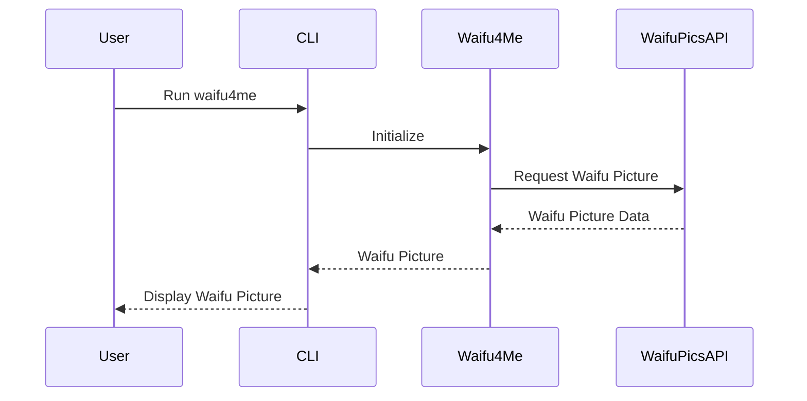

> Sequence diagram that represents the interactions in a CLI application named "waifu4me" written in Rust, which uses the waifu.pics API to fetch waifu pictures.

```mermaid
sequenceDiagram
  participant User
  participant CLI
  participant Waifu4Me
  participant WaifuPicsAPI

  User ->> CLI: Run waifu4me
  CLI ->> Waifu4Me: Initialize
  Waifu4Me ->> WaifuPicsAPI: Request Waifu Picture
  WaifuPicsAPI -->> Waifu4Me: Waifu Picture Data
  Waifu4Me -->> CLI: Waifu Picture
  CLI -->> User: Display Waifu Picture
```
